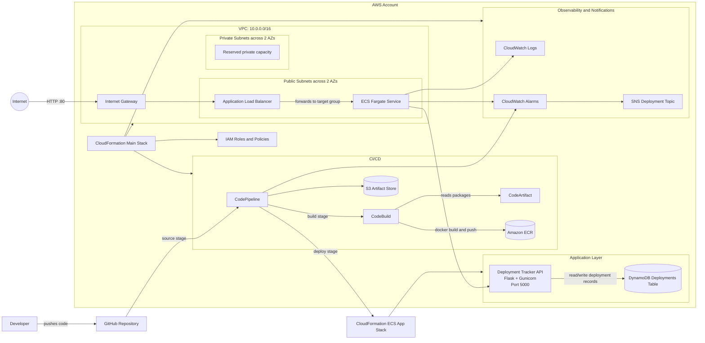

# PipelineForge: AWS-Native Deployment Tracker

## Overview
PipelineForge is a hardened AWS DevOps reference project that solves a specific platform problem: recording and querying deployment events across services and environments. It ships a containerized Flask Deployment Tracker API on ECS Fargate, persists records in DynamoDB, and includes the AWS-native CI/CD path needed to build, deploy, monitor, and operate it.

## Features
- Modular CloudFormation templates
- GitHub-triggered CI/CD pipeline
- Containerized Deployment Tracker API on ECS Fargate
- DynamoDB-backed deployment history
- Application Load Balancer health checks
- Separate ALB and ECS task security groups
- ECS task execution and application roles
- Encrypted and retained pipeline artifacts
- DynamoDB point-in-time recovery and deletion protection
- CloudWatch logs, alarms, container insights, and SNS notifications

## Problem It Solves

Teams often know that a pipeline ran, but not what version of which service reached which environment, who initiated it, or whether it later failed or rolled back. PipelineForge provides a small API for writing deployment events from pipelines and reading recent deployment history during incidents, audits, handoffs, or release reviews.

Example deployment event:

```json
{
  "service": "billing-api",
  "environment": "prod",
  "version": "2026.05.14-1",
  "status": "succeeded",
  "commit_sha": "abc1234",
  "deployed_by": "platform-team"
}
```

Core API endpoints:

- `GET /health`
- `GET /deployments?environment=prod&service=billing-api`
- `GET /deployments/{id}`
- `POST /deployments`

## Architecture



### Component Flow

1. A developer pushes application or infrastructure changes to GitHub.
2. CodePipeline pulls the source, stores pipeline artifacts in S3, and starts CodeBuild.
3. CodeBuild installs dependencies, builds the Docker image from `app/Dockerfile`, tags it with the commit SHA, and pushes it to Amazon ECR.
4. The deployment updates the ECS CloudFormation stack so the Fargate service runs the new container image.
5. The internet-facing Application Load Balancer receives HTTP traffic on port 80 and forwards it to the Deployment Tracker API on port 5000.
6. CloudWatch Logs captures ECS task logs, CloudWatch Alarms monitor pipeline and service health, and SNS sends deployment or failure notifications.
7. The API writes deployment records to DynamoDB and supports listing or filtering recent deployment history.

### Hardening Highlights

- The ECS task has a dedicated application role with scoped DynamoDB access.
- The task execution role uses the `ecs-tasks.amazonaws.com` trust relationship.
- The ALB accepts public HTTP traffic, while ECS tasks only accept traffic from the ALB security group on port 5000.
- DynamoDB uses server-side encryption, point-in-time recovery, streams, and deletion protection.
- The ECR repository scans images on push and expires stale untagged images.
- The pipeline artifact bucket blocks public access, enables encryption, enables versioning, and is retained on stack deletion.
- The app runs under Gunicorn in a non-root Python container and emits basic security headers.

### Infrastructure Stacks

- `main.yml` - Orchestrates the shared platform nested stacks.
- `network.yml` - Creates the VPC, public subnets, private subnets, public route table, and internet gateway.
- `iam.yml` - Defines service roles for CodePipeline, CodeBuild, ECS task execution, and application DynamoDB access.
- `ecr.yml` - Creates the application container image repository.
- `ecs.yml` - Creates the ECS app stack with cluster, Fargate task definition, service, ALB, target group, listener, security groups, and log group.
- `codeartifact.yml` - Creates the package artifact domain and repository.
- `codebuild.yml` - Defines the container build project used by the pipeline.
- `codepipeline.yml` - Defines the GitHub source, CodeBuild build, and CloudFormation deploy stages.
- `dynamodb.yml` - Creates the deployments DynamoDB table.
- `monitoring.yml` - Creates CloudWatch alarms and SNS deployment notifications.

## Repository Structure
- `app/` - Deployment Tracker API source code
- `cloudformation/` - CloudFormation templates
- `scripts/` - Deployment scripts
- `docs/` - Documentation
- `.github/` - GitHub workflows/config

## Deployment
See `docs/deployment.md` for instructions.
