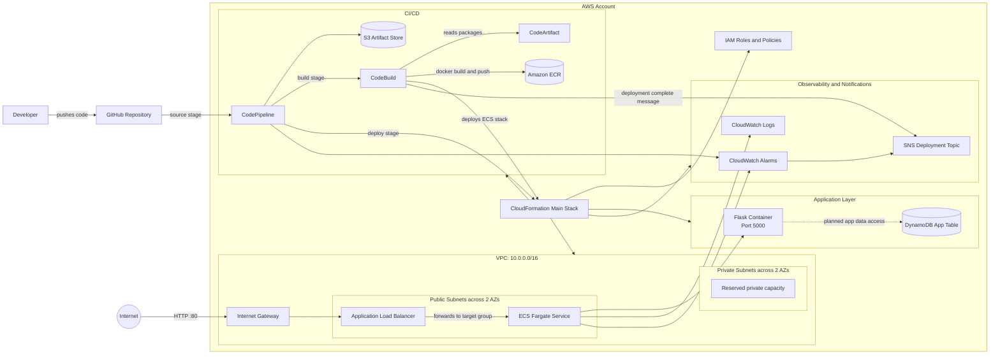

# PipelineForge: AWS-Native CI/CD Platform

## Overview
PipelineForge is a modular, production-grade AWS DevOps platform built with CloudFormation, ECS Fargate, CodePipeline, and more. It demonstrates best practices for cloud-native CI/CD, container deployment, and monitoring.

## Features
- Modular CloudFormation templates
- GitHub-triggered CI/CD pipeline
- Containerized microservice on ECS Fargate
- Automated deployments and rollbacks
- Monitoring and notifications

## Architecture

### Component Flow

1. A developer pushes application or infrastructure changes to GitHub.
2. CodePipeline pulls the source, stores pipeline artifacts in S3, and starts CodeBuild.
3. CodeBuild installs dependencies, builds the Docker image from `app/Dockerfile`, tags it with the commit SHA, and pushes it to Amazon ECR.
4. The deployment updates the ECS CloudFormation stack so the Fargate service runs the new container image.
5. The internet-facing Application Load Balancer receives HTTP traffic on port 80 and forwards it to the Flask container on port 5000.
6. CloudWatch Logs captures ECS task logs, CloudWatch Alarms monitor pipeline and service health, and SNS sends deployment or failure notifications.
7. DynamoDB is provisioned for application data; the current Flask routes include placeholder read/write endpoints for future DynamoDB integration.

### Infrastructure Stacks

- `main.yml` - Orchestrates the nested CloudFormation stacks.
- `network.yml` - Creates the VPC, public subnets, private subnets, public route table, and internet gateway.
- `iam.yml` - Defines service roles for CodePipeline, CodeBuild, and ECS task execution.
- `ecr.yml` - Creates the application container image repository.
- `ecs.yml` - Creates the ECS cluster, Fargate task definition, service, ALB, target group, listener, security group, and log group.
- `codeartifact.yml` - Creates the package artifact domain and repository.
- `codebuild.yml` - Defines the container build project used by the pipeline.
- `codepipeline.yml` - Defines the GitHub source, CodeBuild build, and CloudFormation deploy stages.
- `dynamodb.yml` - Creates the application DynamoDB table.
- `monitoring.yml` - Creates CloudWatch alarms and SNS deployment notifications.

## Repository Structure
- `app/` - Application source code
- `cloudformation/` - CloudFormation templates
- `scripts/` - Deployment scripts
- `docs/` - Documentation
- `.github/` - GitHub workflows/config

## Deployment
See `docs/deployment.md` for instructions.
